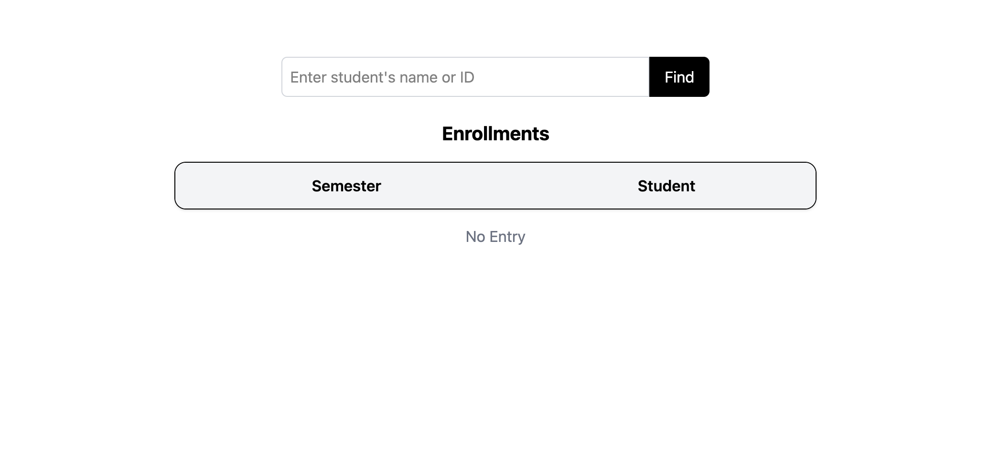
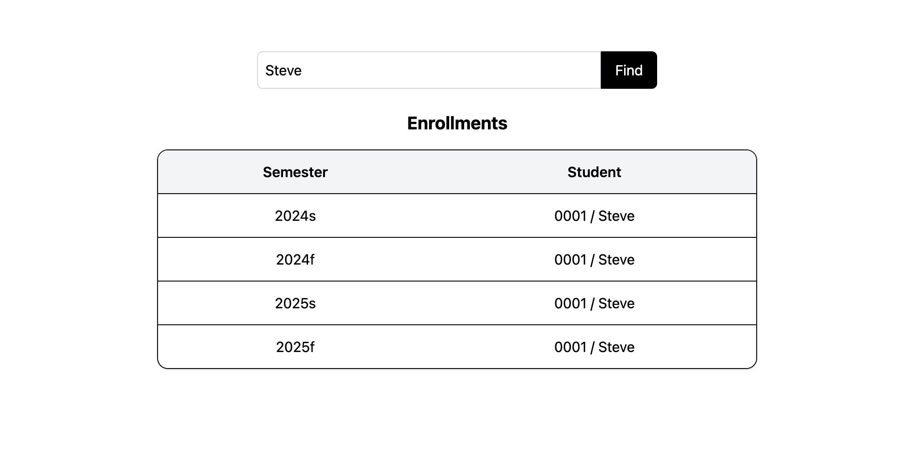
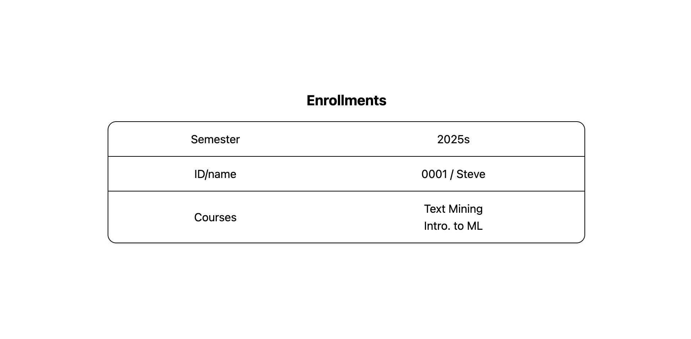

# SDM Homework #2
This project is a web-based search application designed for school administrative staff to manage and view student course enrollments. It features a decoupled architecture with a React frontend and an Express/Node.js backend.

## Architecture
- **Frontend**: React (Vite) + TypeScript + Tailwind CSS
- **Backend**: Node.js (Express.js) + Sequelize ORM
- **Database**: PostgreSQL

## Getting Started

### 1. Database Configuration
The application connects to a PostgreSQL instance. The credentials is based on the assignment specifications.

### 2. Installation and Execution(Development)
1. Backend:
   -  Install dependencies:
      `cd backend && npm install`
   -  Start the Backend Server (typically runs on port 8080):
      `node server.js`
2. Frontend:
   -  Install dependencies:
      `cd frontend && npm install`
   -  Start the Frontend Application:
      `npm run dev`

**Note**: The backend is configured to automatically synchronize the database schema and seed initial data (e.g., student 0001/Steve) upon startup to demo.

## UI Display

### First Webpage (Search)
- **Initial State**: A search interface with an input box for student ID or name.

- **Search**: After entering a keyword and clicking "find," a list of semesters for that student appears.

### Second Webpage (Details)
- **Display Details**: Clicking a specific row in the search results redirects the user to the detail page.

## Database Schema
The system implements a many-to-many relationship between enrollments and courses

### Table Structures

#### enrollments
Stores student identification and the specific semester of registration.

| id | studentId | name | semester | createdAt | updatedAt |
|----|-----------|------|----------|-----------|-----------|
| 1  | 0001      | Steve| 2024s    | ...       | ...       |

#### courses
Stores the names of courses.

| id | name         | createdAt | updatedAt |
|----|--------------|-----------|-----------|
| 1  | Text Mining  | ...       | ...       |
| 2  | Intro. to ML | ...       | ...       |

#### enrollment_courses
The table handling the many-to-many association between enrollments record and courses.

| enrollmentId | courseId | createdAt | updatedAt |
|--------------|----------|-----------|-----------|
| 3            | 1        | ...       | ...       |
| 3            | 2        | ...       | ...       |